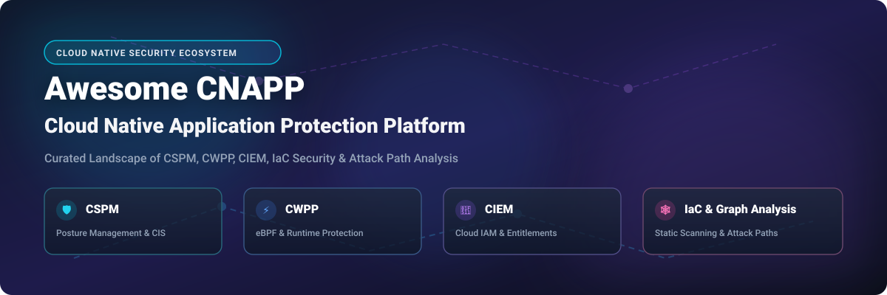
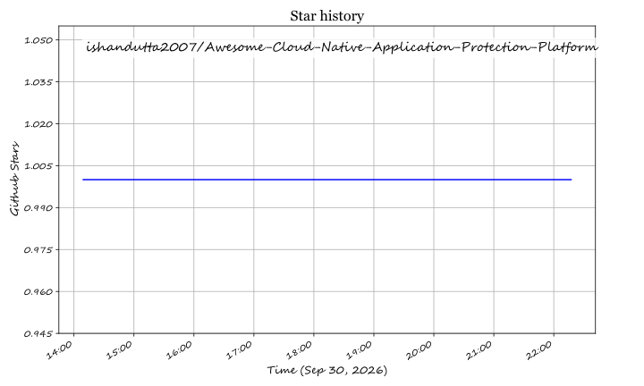

  

# 🛡️ Awesome Cloud Native Application Protection Platform (CNAPP)

  
  
  
  
  

## 🚀 Top Cloud Native Application Protection Platform (CNAPP) Ecosystem & Landscape

> **A curated list of top SaaS products, commercial solutions, and open-source projects for Cloud Native Application Protection Platforms (CNAPP).**  
> *Encompassing Cloud Security Posture Management (CSPM), Cloud Workload Protection Platforms (CWPP), Cloud Infrastructure Entitlement Management (CIEM), Infrastructure as Code (IaC) Security, Data Security Posture Management (DSPM), and Attack Path Analysis.*

📅 **Last updated: September 2026**

---

## 📌 Executive Summary & Market Insights

This repository tracks notable **SaaS platforms** and **open-source projects** in the **Cloud Native Application Protection Platform (CNAPP)** domain. CNAPP unifies security monitoring across the entire software development lifecycle—from build and Infrastructure-as-Code (IaC) scanning to multi-cloud workload runtime protection, identity entitlement analysis, and data security governance.

### 📊 CNAPP Market Overview & Dynamics

> 💡 **Market Size & Valuation**: The global Cloud Native Application Protection Platform (CNAPP) market is estimated at **$12.5 Billion in 2026** and projected to reach over **$29.4 Billion by 2030** (CAGR of ~23.8%).
> 
> ⚖️ **Market Structure & Fragmentation**: The CNAPP market is **moderately fragmented**, but aggressively consolidating toward a **"winner-takes-most"** structure led by market leaders such as Microsoft, Palo Alto Networks, CrowdStrike, and Wiz. While mega-cap cyber vendors acquire best-of-breed startups (e.g., Ermetic, Twistlock, Lacework), open-source security primitives maintain strong adoption for custom enterprise DevSecOps pipelines.

---

## 📚 Table of Contents

- [🛡️ SaaS & Commercial CNAPP Platforms](#-saas--commercial-cnapp-platforms)
- [🔓 Open-Source CNAPP Building Blocks](#-open-source-cnapp-building-blocks)
  - [🛡️ CSPM & Posture Assessment](#-cspm--posture-assessment)
  - [⚡ CWPP & Runtime Security](#-cwpp--runtime-security)
  - [🔑 CIEM & Identity Analysis](#-ciem--identity-analysis)
  - [🏗️ IaC, SBOM & Container Security](#-iac-sbom--container-security)
  - [🕸️ Attack Path Graph & Security Analysis](#-attack-path-graph--security-analysis)
- [📈 Star History](#-star-history)
- [🤝 How to Contribute](#-how-to-contribute)
- [☕ Support & Acknowledgments](#-support--acknowledgments)
- [⚠️ Disclaimer](#%EF%B8%8F-disclaimer)

---

## 🛡️ SaaS & Commercial CNAPP Platforms

The commercial CNAPP landscape features enterprise-grade security platforms providing unified risk visibility, context-rich attack paths, and automated remediation.

The table below is sorted by **Company Size / Revenue / Valuation (Descending)**:

| Platform / Vendor | Description & Key Capabilities | Company Size / Valuation / Revenue | Pricing | Free Tier / Trial Limit |
| :--- | :--- | :--- | :--- | :--- |
| **[Microsoft Defender for Cloud](https://www.microsoft.com/en-us/security/business/microsoft-defender-cloud)** 🟦 | Native CNAPP for Azure, AWS, and GCP via Azure Arc. Provides CSPM (Secure Score), CWPP, DevOps security, and AI-SPM. | **$3.1+ Trillion Market Cap** *(Microsoft Corp)* | Starting at **$0.003/server/hour** (~$2.20/server/month) for Defender for Servers | **30-Day Free Trial** with full access; Free foundational CSPM tier |
| **[Palo Alto Prisma Cloud](https://www.paloaltonetworks.com/prisma/cloud)** 🟧 | Comprehensive CNAPP unifying CSPM, CWPP, CIEM, IaC, and Data Security. Leader in 2025 Gartner Magic Quadrant. | **$110+ Billion Market Cap** | Starting at **$90.00/credit/year** (~$3,000/year base tier) | **30-Day Free Trial** with full feature evaluation |
| **[CrowdStrike Falcon Cloud Security](https://www.crowdstrike.com/)** 🦅 | Real-time CNAPP with EDR lineage, Falcon agent + agentless protection, real-time CDR, and Google Cloud expansion. | **$90+ Billion Market Cap** | Starting at **$215.99/workload/year** (Falcon Cloud Security Go tier) | **15-Day Free Trial** for Falcon platform |
| **[Check Point CloudGuard](https://www.checkpoint.com/)** 🛡️ | Unified CNAPP integrating network security, CSPM, CWPP, CIEM, and WAF application protection across multi-cloud. | **$20+ Billion Market Cap** | Starting at **$150.00/cloud-resource/year** | **30-Day Free Trial** with posture assessment |
| **[Tenable Cloud Security](https://www.tenable.com/)** 🎯 | Best-in-class dedicated CIEM (formerly Ermetic) integrated into Tenable exposure management platform. | **$5.2 Billion Market Cap** | Starting at **$2,500.00/year** (Tenable One / Cloud Security entry package) | **30-Day Free Trial** with automated asset discovery |
| **[SentinelOne Singularity Cloud](https://www.sentinelone.com/)** 🤖 | AI-powered CNAPP with autonomous response, Storyline telemetry, CWPP runtime, and Singularity Data Lake. | **$7.5 Billion Market Cap** | Starting at **$45.00/workload/year** | **30-Day Free Trial** with automated threat simulation |
| **[Wiz](https://www.wiz.io/)** 🪄 | Market leader built on Wiz Security Graph. Agentless-first CNAPP scanning compute, identity, code, and AI workloads. | **$12 Billion Valuation** *(Private)* | Starting at **$18,000.00/year** (~$1,500/month baseline commercial tier) | **14-Day Free Trial** with interactive cloud scan |
| **[Sysdig Secure](https://sysdig.com/)** ⚡ | Falco-powered CNAPP with eBPF-based 5-second runtime threat detection, vulnerability scanning, and CDR. | **$1.3 Billion Valuation** *(Private)* | Starting at **$1,200.00/year** ($100/agent/month entry package) | **30-Day Free Trial** (up to 15 nodes/hosts) |
| **[Orca Security](https://orca.security/)** 🐋 | Agentless-first CNAPP pioneer using SideScanning technology to read block storage out-of-band for 100% cloud coverage. | **$1.8 Billion Valuation** *(Private)* | Starting at **$15,000.00/year** baseline subscription | **30-Day Free Trial** with complete risk assessment report |
| **[Lacework (Fortinet Lacework FortiCNAPP)](https://www.lacework.com/)** 🏰 | Polygraph Data Platform analyzing cloud behavior with ML/AI for anomaly detection across AWS, Azure, GCP, and K8s. | **Acquired by Fortinet** *($68B Fortinet Market Cap)* | Starting at **$3.00/instance/month** (volume unit tiering) | **14-Day Free Trial** with polygraph anomaly mapping |

---

## 🔓 Open-Source CNAPP Building Blocks

While commercial platforms offer single-pane-of-glass correlation, the open-source ecosystem provides modular, enterprise-ready components for building custom CNAPP stacks.

The open-source projects below are sorted by **GitHub Stars_Count (Descending)**:

### 🛡️ CSPM & Posture Assessment

| Project / Tool | GitHub_Stars | Description & Key Features | License |
| :--- | :--- | :--- | :--- |
| **[Trivy](https://github.com/aquasecurity/trivy)** 🛡️ |  | All-in-one security scanner covering container images, filesystems, IaC, Kubernetes misconfigurations, and SBOM generation. | Apache-2.0 |
| **[Checkov](https://github.com/bridgecrewio/checkov)** 🔍 |  | Static code analysis tool for Infrastructure as Code (Terraform, CloudFormation, K8s, Helm) with 750+ built-in policies. | Apache-2.0 |
| **[Prowler](https://github.com/prowler-cloud/prowler)** 🤠 |  | Industry standard multi-cloud security assessment tool for AWS, Azure, GCP, and K8s with 800+ CIS/NIST checks. | Apache-2.0 |
| **[ScoutSuite](https://github.com/nccgroup/ScoutSuite)** 🕵️ |  | Multi-cloud security auditing engine supporting AWS, Azure, GCP, Alibaba Cloud, and Oracle Cloud Infrastructure. | GPL-2.0 |
| **[CloudQuery](https://github.com/cloudquery/cloudquery)** 📊 |  | High-performance open-source data movement framework that transforms cloud asset infrastructure into searchable SQL databases. | MPL-2.0 |
| **[Steampipe](https://github.com/turbot/steampipe)** ⚡ |  | Zero-ETL engine to query cloud APIs, security compliance frameworks, and infrastructure using standard SQL. | AGPL-3.0 |

---

### ⚡ CWPP & Runtime Security

| Project / Tool | GitHub_Stars | Description & Key Features | License |
| :--- | :--- | :--- | :--- |
| **[Falco](https://github.com/falcosecurity/falco)** 🦅 |  | CNCF Graduated runtime threat detection engine for cloud-native workloads using eBPF and Linux kernel syscall filtering. | Apache-2.0 |
| **[KubeArmor](https://github.com/kubearmor/KubeArmor)** 🛡️ |  | CNCF Sandbox LSM-based runtime enforcement engine utilizing AppArmor, SELinux, and BPF-LSM to restrict container capabilities. | Apache-2.0 |
| **[Tracee](https://github.com/aquasecurity/tracee)** 🔎 |  | eBPF-powered engine for real-time Linux system tracing, behavior monitoring, and threat detection with Rego policy rules. | Apache-2.0 |
| **[Tetragon](https://github.com/cilium/tetragon)** 🐙 |  | eBPF-native security observability and real-time in-kernel policy enforcement engine from Isovalent (Cisco). | Apache-2.0 |
| **[Kubescape node-agent](https://github.com/kubescape/node-agent)** ☸️ |  | K8s runtime detection agent using eBPF, CEL policy evaluation, malware scanning (ClamAV), and runtime SBOM mapping. | Apache-2.0 |

---

### 🔑 CIEM & Identity Analysis

| Project / Tool | GitHub_Stars | Description & Key Features | License |
| :--- | :--- | :--- | :--- |
| **[Cloudsplaining](https://github.com/salesforce/cloudsplaining)** 🗝️ |  | AWS IAM policy analysis engine created by Salesforce to identify least-privilege violations and escalation paths. | MIT |
| **[policy_sentry](https://github.com/salesforce/policy_sentry)** 📝 |  | IAM policy generator tool that enforces least-privilege access by authoring policies based on CRUD action declarations. | MIT |
| **[PMapper (Principal Mapper)](https://github.com/nccgroup/PMapper)** 🗺️ |  | Graph-based AWS IAM privilege escalation analyzer evaluating identity policies to uncover lateral movement paths. | BSD-3-Clause |
| **[Kube-bench](https://github.com/aquasecurity/kube-bench)** 🧪 |  | Checks whether Kubernetes cluster nodes and service accounts conform to CIS Kubernetes Benchmarks. | Apache-2.0 |

---

### 🏗️ IaC, SBOM & Container Security

| Project / Tool | GitHub_Stars | Description & Key Features | License |
| :--- | :--- | :--- | :--- |
| **[Syft](https://github.com/anchore/syft)** 📦 |  | CLI tool and library for generating Software Bill of Materials (SBOM) from container images and filesystems. | Apache-2.0 |
| **[Grype](https://github.com/anchore/grype)** 🐛 |  | Vulnerability scanner for container images and filesystems that directly scans Syft-generated SBOMs. | Apache-2.0 |
| **[Terrascan](https://github.com/tenable/terrascan)** 🏗️ |  | Static code analyzer for Infrastructure as Code with 500+ OPA Rego policies across Terraform, K8s, Helm, Dockerfile. | Apache-2.0 |
| **[KICS (Keeping Infrastructure as Code Secure)](https://github.com/Checkmarx/kics)** 🔒 |  | Open-source static analysis engine for IaC by Checkmarx covering Terraform, CloudFormation, Ansible, and Helm. | Apache-2.0 |

---

### 🕸️ Attack Path Graph & Security Analysis

| Project / Tool | GitHub_Stars | Description & Key Features | License |
| :--- | :--- | :--- | :--- |
| **[Cartography](https://github.com/lyft/cartography)** 🌐 |  | Graph analysis engine by Lyft that ingests cloud assets and relationships into Neo4j to visualize complex attack paths. | Apache-2.0 |
| **[BloodHound Enterprise / Community](https://github.com/SpecterOps/BloodHound)** 🩸 |  | Active Directory and Azure IAM relationship graph mapping tool used to identify privilege escalation and attack paths. | GPL-3.0 |
| **[CloudFox](https://github.com/BishopFox/cloudfox)** 🦊 |  | Command-line tool by Bishop Fox to automate cloud security situational awareness and identify attack paths. | MIT |

---

## 📈 Star History

---

## 🤝 How to Contribute

Contributions are welcome! Please follow these guidelines to submit changes:

1. Fork this repository.
2. Add or edit entries in `README.md` maintaining table formatting.
3. Ensure entries include accurate pricing details, stars, and licensing.
4. Check guidelines at [Awesome-Awesome-Awesome](https://github.com/ishandutta2007/Awesome-Awesome-Awesome).
5. Submit a concise Pull Request (PR).

---

## ☕ Support & Acknowledgments

If you find this Cloud Native Application Protection Platform (CNAPP) curated list helpful, please consider supporting the project!

- 🌟 **Star this repository** to help others discover it.
- 🔀 **Fork & Share** with your cloud security and DevSecOps engineering teams.
- 💖 **Sponsor & Buy Me a Coffee**: If you'd like to support ongoing updates, consider sponsoring via [GitHub Sponsors Dashboard](https://github.com/sponsors/ishandutta2007).

---

## ⚠️ Disclaimer

- This repository is a **community-curated index** for informational purposes and does not constitute an explicit endorsement of any tool or commercial vendor.
- CNAPP platforms process critical telemetry, vulnerability feeds, and identity graphs; ensure rigorous access governance and data privacy controls when evaluating solutions.
- **Open-Source vs. Enterprise CNAPP Reality**: Assembling open-source tools (e.g., Prowler + Falco + PMapper + Cartography) requires dedicated engineering overhead (~0.5–2 FTE). Commercial SaaS CNAPPs deliver immediate out-of-the-box cross-pillar correlation and managed support.

## ⭐ Star History

<a href="https://star-history.com/#ishandutta2007/Awesome-Cloud-Native-Application-Protection-Platform&Timeline" align="center">
  <picture>
    <source media="(prefers-color-scheme: dark)" srcset="assets/ishandutta2007_Awesome-Cloud-Native-Application-Protection-Platform_growth.svg">
    
  </picture>
</a>
